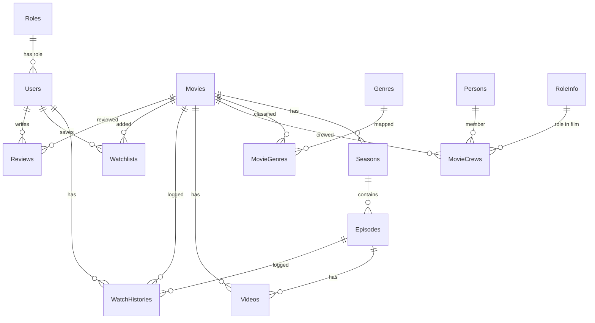

# Báo Cáo Audit Kỹ Thuật Chi Tiết Dự Án TviEn

---

## 1. TỔNG QUAN DỰ ÁN

### Mục đích & Chức năng
**TviEn** là một hệ thống truyền phát video trực tuyến (Streaming Platform) hỗ trợ cả phim lẻ (Single Movies) và phim bộ (TV Series). Dự án tập trung vào tính bảo mật cao thông qua việc mã hóa video bằng chuẩn **AES-128 HLS DRM**, ngăn chặn tải lậu (chặn IDM, UC Browser, Cốc Cốc qua kiểm tra Referer Header), và phân phối nội dung qua Cloudflare R2 Storage.

### Kiến trúc Hệ thống
Dự án được xây dựng theo kiến trúc phân tán (Distributed Services) gồm các phần chính sau:
1. **Backend API (ASP.NET Core Web API)**: đóng vai trò là API Gateway và Server điều hướng chính. Chịu trách nhiệm quản lý cơ sở dữ liệu, xác thực JWT, phục vụ API Admin/Public, ký Presigned URL từ Cloudflare R2, và kiểm tra quyền truy cập qua Gatekeeper.
2. **Video Worker (Console App Background Service)**: Chạy ngầm để xử lý chuyển mã (Transcode) video thô tải lên từ R2. Sử dụng **FFmpeg** để cắt video thành các phân đoạn HLS (.ts), mã hóa AES-128 đồng thời tạo file preview 30 giây (.mp4). Giao tiếp với Backend qua hàng đợi Redis (`tvien:ingest_queue`) và ghi kết quả vào PostgreSQL DB.
3. **User Frontend (Next.js)**: Ứng dụng client-side cho người xem, sử dụng thư viện `hls.js` được tùy biến giao diện trình phát cao cấp, hỗ trợ thay đổi độ phân giải tự động/thủ công, lưu tiến trình xem phim, đánh giá phim và quản lý danh sách xem sau.
4. **Admin Dashboard (Tích hợp trong Next.js tại `/admin`)**: Giao diện quản lý toàn bộ hệ thống (danh mục phim, tập phim, thể loại, user, watch history, watchlist, reviews, ingest jobs) thông qua API Generic (SystemAdminController).
5. **CDN Gatekeeper (Cloudflare Worker hoặc Controller Proxy)**: Đứng trước R2 để kiểm tra JWT token ngắn hạn đính kèm trong các request phân đoạn video (.ts) và playlist (.m3u8) nhằm ngăn chặn việc chia sẻ link trực tiếp.

### Tech Stack Chi Tiết
*   **Ngôn ngữ lập trình**: C# (Backend & Worker - .NET 8.0), TypeScript/JavaScript (Frontend).
*   **Framework chính**: ASP.NET Core (Web API), Next.js 14+ (React).
*   **Database & ORM**: PostgreSQL, Entity Framework Core 8.0.
*   **Cache & Queue**: Redis (StackExchange.Redis) đóng vai trò Message Broker và lưu trữ tiến độ transcode.
*   **Storage**: Cloudflare R2 (tương thích AWS S3 SDK).
*   **Thư viện xử lý đa phương tiện**: FFmpeg CLI (Worker), SixLabors.ImageSharp (nén và chuyển đổi ảnh sang WebP ở Backend).
*   **Security**: JWT Bearer Authentication, BCrypt.Net-Next (hash mật khẩu), AES-128 HLS Encryption.
*   **Giám sát (Monitoring)**: Prometheus & Grafana (tích hợp qua prometheus-net).

---

## 2. CẤU TRÚC THƯ MỤC DỰ ÁN

```
ProjectTviEn/
├── backend/                       # ASP.NET Core API Service
│   ├── Controllers/               # Các API Endpoints
│   │   ├── Admin/                 # Quản trị (Movies, Genres, SystemAdmin generic,...)
│   │   └── Public/                # Công khai (Auth, Gatekeeper, Keys, Reviews,...)
│   ├── Data/                      # DbContext và Seed dữ liệu mẫu (DataSeeder.cs)
│   ├── DTOs/                      # Data Transfer Objects
│   ├── Migrations/                # Lịch sử database migrations của EF Core
│   ├── Models/                    # Các C# Entity Models map với PostgreSQL
│   ├── Services/                  # Business Logic (R2Service, GmailEmailService)
│   ├── Program.cs                 # File khởi tạo chính của Backend
│   └── appsettings.json           # Cấu hình local (Kết nối DB, Redis, R2, JWT, Email)
├── ProjectTviEn.Worker/           # Background Video Transcoder Service
│   ├── Program.cs                 # Vòng lặp lấy job Redis, chạy FFmpeg transcode & upload
│   └── appsettings.json           # Cấu hình môi trường của Worker
├── user-frontend/                 # Ứng dụng Next.js
│   ├── src/
│   │   ├── components/            # Các UI Components (Navbar, AuthModal)
│   │   ├── context/               # AuthContext.tsx quản lý trạng thái đăng nhập
│   │   ├── pages/
│   │   │   ├── index.tsx          # Trang chủ người dùng (Search, Filter, Featured)
│   │   │   ├── reset-password.tsx # Giao diện lấy lại mật khẩu OTP
│   │   │   ├── watch/[slug].tsx   # Trình phát phim HLS custom + Watchlist + Reviews
│   │   │   └── admin/             # Dashboard Admin và bảng quản lý generic
│   │   └── styles/                # CSS Stylesheets
├── cloudflare-worker/             # Cloudflare Worker code
│   └── gatekeeper.js              # Script proxy xác thực token trên CDN Edge
├── docker-compose.yml             # Chạy các service phụ trợ local (Postgres, Redis, Grafana, Prometheus)
└── scripts/                       # Các file bat khởi động nhanh dự án local
```

---

## 3. DATABASE SCHEMA & QUAN HỆ THỰC THỂ

Hệ thống lưu trữ trên PostgreSQL với các bảng chính sau:



### Chi tiết các thực thể:
1.  **Roles**: Phân quyền tài khoản (`RoleId = 1: Admin`, `2: VIP`, `3: Member`).
2.  **Users**: Thông tin tài khoản người dùng, hỗ trợ cả `GoogleId` (OAuth) và `PasswordHash` (Email/Pass), quản lý khóa tài khoản qua `IsActive`.
3.  **Movies**: Bảng chứa thông tin phim (Tiêu đề, Poster, Backdrop, Trailer, Năm, Duration, AgeRating). Phân biệt qua trường `Type` (`1: SingleMovie` - Phim lẻ | `2: TvSeries` - Phim bộ).
4.  **Seasons**: Phân mùa cho Phim bộ. Cascade delete khi xóa Phim.
5.  **Episodes**: Tập phim thuộc về Season & Movie. Cascade delete khi xóa Season.
6.  **Videos**: Đường dẫn master playlist HLS (.m3u8) trên R2, chứa thông tin mã hóa AES-128 (`EncryptionKey` Base64 và `IV`) để giải mã. Liên kết trực tiếp với `MovieId` (phim lẻ) hoặc `EpisodeId` (phim bộ).
7.  **IngestJobs**: Nhật ký các phiên transcode video ngầm (`pending`, `processing`, `done`, `failed`).
8.  **Genres** & **MovieGenres**: Quản lý thể loại phim (nhiều - nhiều).
9.  **Persons**, **RoleInfo** & **MovieCrews**: Danh sách diễn viên, đạo diễn, biên kịch tham gia phim (nhiều - nhiều).
10. **WatchHistories**: Lưu tiến trình xem phim (`ProgressSeconds`, `IsCompleted`) để người dùng xem tiếp.
11. **Watchlists**: Danh sách phim yêu thích lưu lại để xem sau.
12. **Reviews**: Người dùng đánh giá phim thang điểm 10 kèm nhận xét.

### Lịch sử Migrations:
*   `20260430064214_InitialRefactor`: Tạo khung cấu trúc cốt lõi.
*   `20260501002124_AddEpisodeIdToMediaAssets`: Gắn EpisodeId vào asset.
*   `20260513082214_AddSeasonsTable`: Thêm bảng Seasons, tạo chuỗi liên kết Cascade 3 tầng: `Movie -> Season -> Episode`.
*   `20260513091428_AddMovieTypeColumn`: Thêm cột Type vào Movie.
*   `20260605100017_AddPasswordToUser`: Hỗ trợ trường PasswordHash.
*   `20260617035655_AddPasswordResetTokenToUser`: Thêm token và hạn dùng OTP để quên mật khẩu.

---

## 4. DANH SÁCH API ENDPOINTS

### PUBLIC APIs (Cho Client người dùng & Worker)
*   **Xác thực (`api/public/auth`)**:
    *   `POST /login`: Đăng nhập bằng Email/Password truyền thống -> Trả về JWT Token.
    *   `POST /register`: Đăng ký tài khoản mới.
    *   `POST /google-login`: Đăng nhập/Đăng ký tự động qua Google ID Token.
    *   `POST /forgot-password`: Gửi yêu cầu OTP lấy lại mật khẩu.
    *   `POST /verify-otp`: Kiểm tra OTP và đổi mật khẩu mới.
*   **Bảo mật Video & DRM**:
    *   `GET /api/public/gatekeeper/video/{movieId}/{**filePath}`: Proxy trung gian xác thực JWT token của phim. Nếu hợp lệ, tải file từ R2 và trả về. Đối với playlist `.m3u8`, API tự động chèn token vào các dòng phân đoạn và đường dẫn lấy Key giải mã.
    *   `GET /api/public/keys/{id}?token={jwt}`: Trả về khóa giải mã AES-128 dạng nhị phân (`application/octet-stream`). Chặn tải lậu bằng cách kiểm tra Header `Referer` (chỉ chấp nhận localhost, domain web chính thức).
*   **Tính năng bổ sung**:
    *   `GET/POST /api/public/reviews`: Xem/Gửi bình luận đánh giá.
    *   `GET/POST/DELETE /api/public/watchhistory`: Xem/Lưu/Xóa tiến trình lịch sử xem phim.
    *   `GET/POST/DELETE /api/public/watchlist`: Quản lý danh sách xem sau.

### ADMIN APIs (Yêu cầu JWT có Claim Role `Admin` hoặc `super`)
*   **Quản lý Phim (`api/admin/Movies`)**:
    *   `GET /`: Lấy toàn bộ danh sách phim (kèm crew, genre, trạng thái ingest).
    *   `GET /{id}` & `GET /slug/{slug}`: Chi tiết phim.
    *   `POST /` & `PUT /{id}`: Thêm và cập nhật phim.
    *   `POST /{id}/upload-poster` & `POST /{id}/upload-backdrop`: Upload ảnh WebP và resize tự động lên R2.
    *   `GET /{id}/play` & `GET /slug/{slug}/play`: Lấy link xem phim của admin kèm JWT token hợp lệ cấp quyền cho Gatekeeper.
*   **Generic CRUD System (`api/admin/system`)**:
    *   `GET /stats`: Thống kê số lượng record của tất cả các bảng.
    *   `GET /tables/{tableName}`: Đọc dữ liệu của bảng bất kỳ (hỗ trợ phân trang/xóa mềm).
    *   `POST /tables/{tableName}`: Tạo mới bản ghi bằng cách nhận diện Dynamic Type.
    *   `DELETE /tables/{tableName}/{id}`: Xóa cứng hoặc xóa mềm (Soft delete) bản ghi theo ID.

---

## 5. LUỒNG XỬ LÝ CHÍNH: CHUYỂN MÃ & TRUYỀN PHÁT VIDEO (INGEST & STREAM)

Luồng dữ liệu di chuyển từ lúc Admin tải video lên cho đến khi người dùng xem phim:

```
[ADMIN DASHBOARD]
      │
      ▼ (Upload file video gốc lên R2 thông qua presigned URL)
[Cloudflare R2 Bucket] (tvien-media-raw)
      │
      ▼ (Admin tạo IngestJob bằng cách chỉ định đường dẫn raw file trên R2)
[Backend API] ───(Đẩy JobId vào Redis List)───► [Redis Queue] (tvien:ingest_queue)
                                                       │
                                                       ▼ (Worker pop JobId để xử lý)
                                             [ProjectTviEn.Worker]
                                                       │
  ┌────────────────────────────────────────────────────┴──────────────────────────────────────────────────┐
  │  1. Tải file video gốc (.mp4) từ R2 về thư mục temp local của Worker.                                 │
  │  2. Tạo ngẫu nhiên khóa mã hóa AES-128 (16 bytes).                                                    │
  │  3. Chạy FFmpeg song song phân tách thành 3 chất lượng: 480p, 720p, 1080p.                             │
  │  4. FFmpeg mã hóa từng phân đoạn .ts và tạo file playlist index.m3u8 tương ứng.                       │
  │  5. FFmpeg cắt 30 giây đầu tạo file preview.mp4 (không tiếng, độ phân giải thấp) cho trang chủ.       │
  │  6. Upload toàn bộ thư mục HLS (m3u8, ts) và preview.mp4 lên R2.                                      │
  │  7. Ghi khóa EncryptionKey (Base64) vào bảng Videos trong DB PostgreSQL.                              │
  │  8. Xóa thư mục temp và cập nhật trạng thái job thành "done".                                         │
  └────────────────────────────────────────────────────┬──────────────────────────────────────────────────┘
                                                       │
                                                       ▼ (Người dùng bấm nút PLAY)
[User Frontend (hls.js)] ◄───(Yêu cầu PlayUrl + Short-lived JWT)─── [Backend API]
      │
      ├─► (1. Tải Playlist m3u8 bảo mật) ────► [Gatekeeper Controller / Worker]
      │                                                   │ (Xác thực JWT Token thành công)
      │                                                   │ (Nhúng token động vào URL các file .ts & .key)
      │                                                   ▼
      │ ◄── (Trả về Master Playlist .m3u8 đã sửa đổi) ────┘
      │
      ├─► (2. Tải các phân đoạn video mã hóa) ──► [Cloudflare R2 (qua Gatekeeper)] -> trả về segment.ts
      │
      └─► (3. Gọi khóa để giải mã tại chỗ) ──► [Keys Controller]
                                                          │ (Kiểm tra Referer để chặn download lậu)
                                                          ▼
                                            [Trả về khóa nhị phân 16-byte] ────► (Giải mã & Play)
```

---

## 6. TRẠNG THÁI HOÀN THIỆN CỦA CÁC TÍNH NĂNG

| Tính năng | Trạng thái | Ghi chú từ Code thực tế |
| :--- | :---: | :--- |
| **Đăng nhập Google OAuth** | **Hoàn thành** | Đã cấu hình và kết nối đồng bộ Frontend - Backend. |
| **Đăng nhập Email/Mật khẩu** | **Hoàn thành** | Mã hóa mật khẩu bằng BCrypt, phân quyền role chuẩn xác. |
| **Generic Admin CRUD** | **Hoàn thành** | Sử dụng Reflection xử lý tất cả bảng DB tại `SystemAdminController`. |
| **Ingestion Worker & FFmpeg** | **Hoàn thành** | Chuyển mã đa chất lượng HLS, mã hóa AES-128 DRM tốt. |
| **Tạo Video Preview 30s** | **Hoàn thành** | Đã thêm logic FFmpeg tạo `preview.mp4` trong Worker. |
| **DRM Gatekeeper & Key Server** | **Hoàn thành** | Xác thực JWT trong luồng m3u8 và chặn Referer lậu ở Key Server. |
| **Watch History & Watchlist** | **Hoàn thành** | Định kỳ 10 giây lưu tiến trình xem phim của user. |
| **Tìm kiếm & Lọc nâng cao** | **Hoàn thành** | Hỗ trợ tìm kiếm kết hợp comma-separated tại Navbar Frontend. |
| **Khôi phục mật khẩu qua OTP** | *Dở dang* | Logic trên FE/BE đã viết, nhưng `GmailEmailService` chưa cấu hình tài khoản gửi SMTP thực tế (mới chỉ ghi đè ra Log console). |
| **Generate Preview (Admin)** | *Dở dang* | Endpoint trigger thủ công `/generate-preview` trong `MoviesController` đang bị khóa (comment out) do chưa đăng ký DI `IAmazonS3` đơn lẻ. |
| **Phân quyền VIP / Mua gói** | *Chưa làm* | Cột `VipExpiresAt` đã có trong Database nhưng API Gatekeeper chưa có logic kiểm tra thời hạn VIP để chặn xem phim đối với các phim gắn tag VIP. |
| **Multi-Season Navigation** | *Chưa làm* | Frontend đang mặc định lấy tập 1 của season 1. Chưa có dropdown chọn tập, chọn mùa cho TV Series trên giao diện. |

---

## 7. CẤU HÌNH & TRIỂN KHAI (DEPLOYMENT)

### Các biến môi trường bắt buộc (.env / Render Variables)
*   **Database**: `DATABASE_URL` (hỗ trợ cả định dạng `postgresql://` của Neon/Render).
*   **Cache/Queue**: `REDIS_URL` hoặc `REDIS_EXTERNAL_URL`.
*   **DRM Security**: `Jwt:Key` (Khóa ký JWT bí mật, độ dài tối thiểu 32 ký tự).
*   **Networking**: `BackendUrl` (URL Backend, vị ý `https://tvien-api.onrender.com`). Cần thiết để Gatekeeper chèn đúng địa chỉ cấp khóa DRM, tránh lỗi Mixed Content.
*   **Cloudflare R2 Storage**:
    *   `R2:AccessKey` & `R2:SecretKey`: API keys của Cloudflare.
    *   `R2:Endpoint`: URL endpoint R2 (dạng `https://<account-id>.r2.cloudflarestorage.com`).
    *   `R2:BucketName`: Tên bucket chứa video raw và stream.
*   **Email SMTP** (Khi chạy thực tế):
    *   `Email:SenderEmail` & `Email:SenderPassword` (Mật khẩu ứng dụng Gmail).

### Cấu hình Docker & Production Host
1.  **Dịch vụ bổ trợ (Local)**: Chạy qua `docker-compose.yml` gồm PostgreSQL (cổng 5433), Redis (cổng 6379), Adminer (quản trị DB, cổng 8081), Prometheus & Grafana.
2.  **API Backend**: Build qua `backend/Dockerfile` (Multi-stage build). Phù hợp deploy lên các nền tảng PaaS như Render, Railway.
3.  **Frontend**: Deploy lên Vercel. File `Program.cs` đã cấu hình CORS chấp nhận domain Vercel.

---

## 8. CÁC VẤN ĐỀ PHÁT HIỆN & KHẢ NĂNG CHẠY THỰC TẾ (LOCAL VS HOST)

### ⚠️ So sánh Khả năng hoạt động (Local vs Deploy Host)

#### 1. Các tính năng hoạt động tốt ở Local:
*   **Đăng nhập, đăng ký, lưu lịch sử, watchlist, review**: Chạy mượt mà, không gặp bất cứ lỗi CORS nào nhờ cấu hình local.
*   **Xử lý video (Worker & FFmpeg)**: Hoạt động tốt nếu máy tính local đã cài đặt sẵn thư viện FFmpeg trong PATH. Worker chạy tốn nhiều CPU nhưng không bị giới hạn phần cứng.
*   **Xem phim giải mã DRM**: Chạy tốt do local sử dụng cùng host `localhost:5113` để cấp khóa.

#### 2. Các vấn đề nghiêm trọng / Chưa hoạt động khi Deploy Host:

1.  **Lỗi Hardcode Localhost trong HLS Key (Worker)**:
    *   *Mã lỗi*: Trong worker `Program.cs` dòng 300, đường dẫn key API gửi cho FFmpeg được hardcode là:
        `string keyApiUrl = $"http://localhost:5113/api/public/keys/{jobId}";`
    *   *Hậu quả*: Khi deploy lên môi trường cloud (Render, Vercel), video transcode xong sẽ chứa đường dẫn khóa trỏ về `localhost:5113`. Khi người dùng mở trình duyệt xem phim, trình phát Hls.js sẽ cố gắng tải khóa giải mã từ máy của... chính họ (`localhost:5113`) -> **Gây lỗi không thể xem phim (Không giải mã được video)**.
    *   *Cách khắc phục*: Sửa Worker để lấy URL Backend từ cấu hình môi trường (ví dụ `BACKEND_URL`) thay vì hardcode localhost.
2.  **Thiếu FFmpeg trên môi trường Cloud Worker**:
    *   *Hậu quả*: Nếu deploy project `ProjectTviEn.Worker` lên Render/Railway dưới dạng image thông thường mà không có FFmpeg, Worker sẽ crash ngay lập tức khi nhận job transcode đầu tiên vì không tìm thấy file thực thi `ffmpeg`.
    *   *Cách khắc phục*: Phải sử dụng Dockerfile tùy biến cho Worker, có cài đặt gói `ffmpeg` qua package manager (ví dụ: `apt-get install -y ffmpeg`).
3.  **Lỗi gửi mail OTP**:
    *   *Hậu quả*: Do `SenderEmail` và `SenderPassword` trong config production đang trống, tính năng quên mật khẩu sẽ hoàn toàn bị vô hiệu hóa khi deploy. Khách hàng sẽ không nhận được OTP.
    *   *Cách khắc phục*: Cấu hình đầy đủ thông số SMTP Gmail trên môi trường Host.
4.  **Giới hạn tài nguyên phần cứng (Memory & Disk Limit) trên Free Host**:
    *   *Hậu quả*: Quá trình transcode video bằng FFmpeg cực kỳ tốn CPU và RAM. Nếu chạy Worker trên gói Free của Render hoặc các cloud giá rẻ, worker sẽ bị hệ thống kill (Out Of Memory) hoặc hết dung lượng đĩa tạm thời khi xử lý các video thô dung lượng lớn.
    *   *Cách khắc phục*: Cần cấp cấu hình RAM tối thiểu 2GB cho Worker, hoặc cấu hình FFmpeg transcode tuần tự/giảm thread.

### Code Smell & Điểm cần cải tiến
*   **Xử lý lỗi SMTP**: Trong `GmailEmailService.cs`, nếu gửi SMTP lỗi, hệ thống log lỗi và throw exception luôn. Điều này có thể làm crash luồng đăng ký/quên mật khẩu của người dùng thay vì thông báo lỗi thân thiện.
*   **Thiếu validation định dạng file thô**: Worker tự động download mọi file được yêu cầu trong job mà không kiểm tra định dạng/dung lượng trước khi xử lý, có thể gây tràn đĩa.
